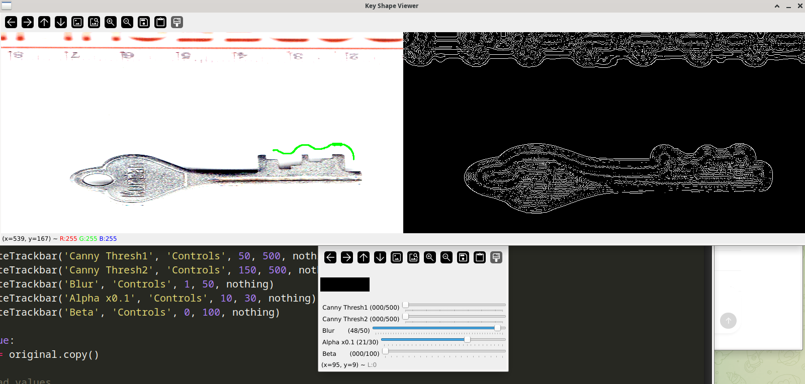

# KeyDecoderBuild
KeyDecoderBuild is a hardware-based tool that reads physical keys and converts them into digital key values.


<p float="left">
  
</p>


### RUN

```
py main.py

```


### BASIC

```
https://www.instructables.com/Duplicate-Keys-by-Hand/
```


Pro-Lok IC/A2 Decoder 


### notes


```
https://www.luxiousauto.com/flipkeys

 How to Decode a Control Key for Small Format Core (SFIC) 
https://www.youtube.com/watch?v=MNPZwheGJ5Q


 How to Copy a Key from Image/Video - Keep your Keys Safe! 
https://www.youtube.com/watch?v=1P_mDboKg4U&ab_channel=JonLock
https://www.youtube.com/watch?v=SO0Y0HLvvpA&ab_channel=BackyardAmusement

https://www.locksmithmag.com/news/vag-laser-key/

https://www.locksmithmag.com/magazine/issue-2-april-2016/


 How To Easily Decode a Key On Your Computer 
https://www.youtube.com/watch?v=Xml10yE9cus


https://github.com/deviantollam/Key-and-Pin-Decoding
https://github.com/deviantollam/SuperBumpKeys


https://github.com/lowerrandom/SuperBumpKeys
https://github.com/lowerrandom/UltimateHandCuffKey


https://github.com/tawrid/KeyDecoder_C123


https://github.com/MaximeBeasse/KeyDecoder
https://www.youtube.com/watch?v=QXceYKrL2Ok
https://en.wikipedia.org/wiki/Bitting_(key)


https://hackaday.com/2023/01/21/all-your-keys-are-belong-to-keydecoder/


https://www.youtube.com/watch?v=CiUh_BjIsUg
https://www.youtube.com/watch?v=Am9TLm630HM

https://www.idownloadblog.com/2013/08/08/keyme-app-store-share-keys/

```


### 3D Locksport


```
https://www.youtube.com/watch?v=ANx4LYxhThw
https://github.com/lowerrandom/LishiKeyCuttingGuides


https://cults3d.com/en/3d-model/tool/key-decoder-for-duplicating-house-keys
```


https://www.lockpicking101.com/viewtopic.php?f=54&t=59275


### ADN

```
https://www.cnet.com/news/privacy/duplicating-keys-from-a-photograph/


https://repo.zenk-security.com/?dir=./Lockpicking
https://jacobsschool.ucsd.edu/news/release/791?id=791


http://grozi.calit2.net/
```


### CAST

```
https://www.lockpickworld.com/products/professional-locksmiths-key-duplication-system

```


### PAPER

```
https://knowledgecommons.lakeheadu.ca/handle/2453/266
https://annas-archive.org/scidb?doi=10.1109/sice.2006.314639
https://knowledgecommons.lakeheadu.ca/bitstream/handle/2453/266/NematollahiN2012m-1a.pdf?sequence=4&isAllowed=y


https://annas-archive.org/scidb/10.1109/sice.2006.314640/
https://ieeexplore.ieee.org/abstract/document/4108596
10.1109/SICE.2006.314639


```


Need to find out

```


10.1109/TPAMI.2007.1014

https://www.cv-foundation.org//openaccess/content_cvpr_workshops_2013/W09/papers/Wang_Duplicate_Discovery_on_2013_CVPR_paper.pdf


```


